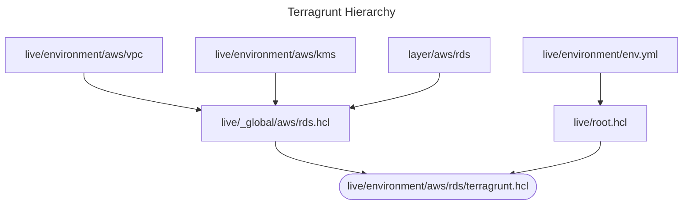

# HOW TO USE

## Versions

```bash
terraform
 *1.10.5 <-- (Due to the MAC)
  1.5.7 <-- (It works as well)
terragrunt
 *0.72.6
```

## Folder structure

```bash
.
├── layers
│   ├── aws
│   │   ├── ec2
│   │   │   └── templates
│   │   ├── kms
│   │   ├── rds
│   │   └── vpc
│   └── db
│       └── mysql
│           ├── schema
│           └── user
└── live
    ├── dev
    │   ├── aws
    │   │   ├── ec2
    │   │   ├── kms
    │   │   ├── rds
    │   │   └── vpc
    │   └── db
    │       ├── app-db-schemas
    │       └── app-db-users
    ├── _global
    │   ├── aws
    │   └── db
    │       └── mysql
    └── test
        ├── aws
        │   ├── ec2
        │   ├── kms
        │   ├── rds
        │   └── vpc
        └── db
            ├── app-db-schemas
            ├── app-db-users
            ├── reporting-db-schemas
            └── reporting-db-users
```

* **layers** -> Contains all the Terraform code that is not call from an external module repository.
  * aws -> Contains the Terraform code for all the AWS resources inside the respective resource folder.
  * db -> Contains the Terraform code for all the RDBMS resources, inside the respective engine folder.
    * mysql -> Contains the Terraform code for the creation of MySQL Schemas and Users/Grants.
* **live** -> Contains what is currently deployed on each environment.
  * dev -> Contains what is deployed on the Development environment. This will use the local `env.yml` file to local specific environment configurations.
    * aws -> Contains what is deployed at the AWS level, using the respective resource folder.
    * db -> Contains what is deployed at the RDBMS level.
  * test ->  Contains what is deployed on the Test environment. The rest of the structure is similar to the previous explained.
  * _global -> Contains the Global **Terragrunt** configuration for each kind of resource. This avoids repeating the code across environments.
    * aws -> Contains global **Terragrunt** configurations at the AWS resource level.
    * db -> Contains global **Terragrunt** configurations for the RDBMS, inside the respective engine folder.
      * mysql -> Contains global **Terragrunt** configurations for the MySQL Schemas and Users/Grants.

## Terragrunt Hierarchy

This is the basic hierarchy that Terragrunt will apply their configurations.

Exemple for the AWS RDS:



## Commands

From the root folder:

```bash
terragrunt run-all <plan|apply|destroy>
terragrunt run-all <plan|apply|destroy> --terragrunt-exclude-dir="**/db/**"
terragrunt run-all <plan|apply|destroy> --terragrunt-exclude-dir="**/db/**" --terragrunt-exclude-dir="**/test/**"

terragrunt run-all <plan|apply|destroy> --terragrunt-working-dir="./live/dev/" 
terragrunt run-all <plan|apply|destroy> --terragrunt-working-dir="./live/dev/aws"
terragrunt run-all <plan|apply|destroy> --terragrunt-working-dir="./live/dev" --terragrunt-exclude-dir="**/db/**"
terragrunt run-all <plan|apply|destroy> --terragrunt-working-dir="./live/" --terragrunt-exclude-dir="**/db/**"

terragrunt <plan|apply|destroy> --terragrunt-working-dir="./live/dev/aws/ec2"
```

From the exact folder

```bash
cd live/dev/aws/vpc
terragrunt <plan|apply|destroy>

cd live/dev
terragrunt run-all <plan|apply|destroy>
terragrunt run-all <plan|apply|destroy> --terragrunt-exclude-dir="**/db/**"

cd live
terragrunt run-all <plan|apply|destroy>
terragrunt run-all <plan|apply|destroy> --terragrunt-exclude-dir="**/db/**"
terragrunt run-all <plan|apply|destroy> --terragrunt-exclude-dir="**/db/**" --terragrunt-exclude-dir="/test/**"
```

To format the `.tf` and `.hcl` files

```bash
terraform fmt -recursive
terragrunt hclfmt
```

To clean the init, cache and locks

```bash
find . -type d -name ".terragrunt-cache" -prune -exec rm -rf {} \;
find . -type f -name ".terraform.locl.hcl" -prune -exec rm -rf {} \;
```

There is a helper created for that at the root folder

```bash
chmod +x ./fix.sh
./fix.sh
```